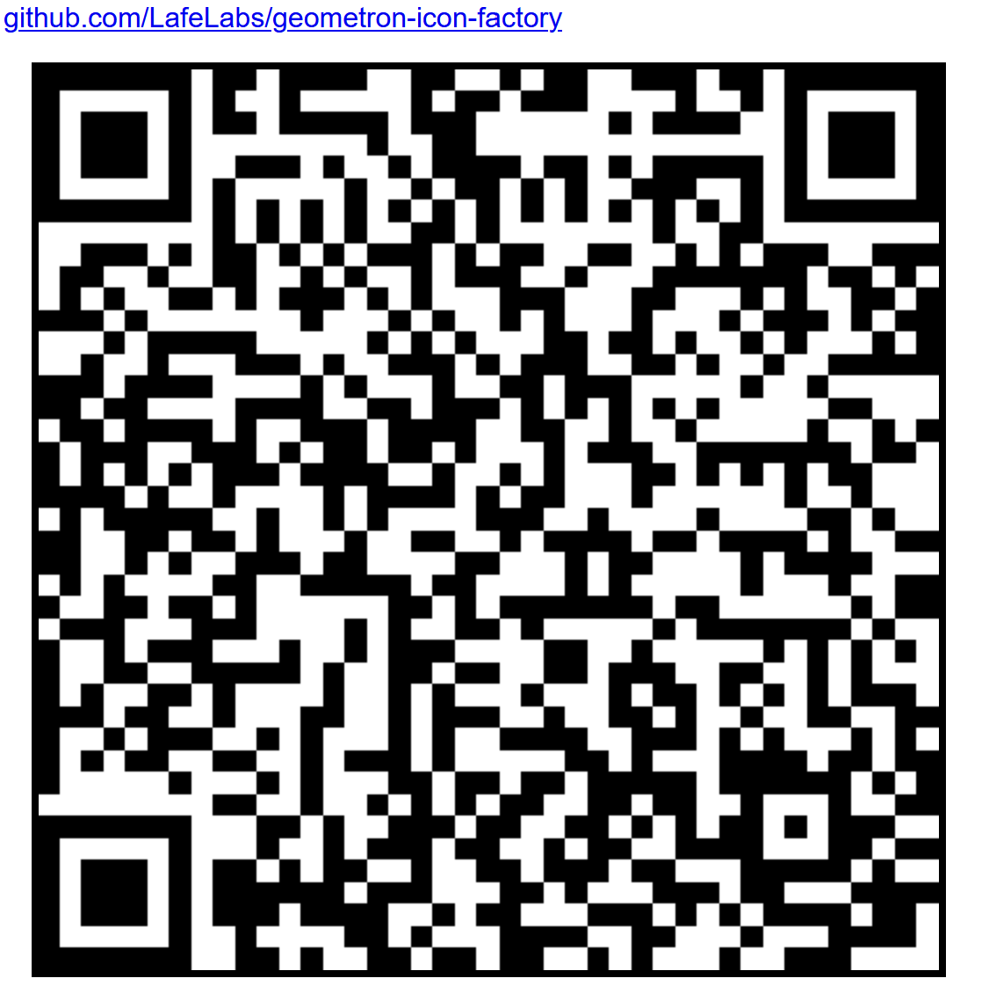

# [GEOMETRON ICON FACTORY](github.com/LafeLabs/geometron-icon-factory)

GEOMETRON IS A GEOMETRIC LANGUAGE!
GEOMETRON GLYPHS CAN BE USED TO CREATE GRAPHICAL LANGUAGES OF ULTRA LIGHT WEIGHT AND PORTABLE ICONS FOR EASY REPLICATION ACROSS THE OPEN WEB!

EDIT ICONS ON LOCAL GEOMETRON INSTANCES AND THEN SHARE ACROSS THE NETWORK!

USE ICONS TO BUILD APPS AND USE APPS TO BUILD ICONS!

 - [index.html](index.html)
 - [readme.html](readme.html)
 - [http://localhost/geometron-icon-factory/](http://localhost/geometron-icon-factory/)
 - [trash robot](https://trashrobot.net/)
 - [qrcode.html](qrcode.html)